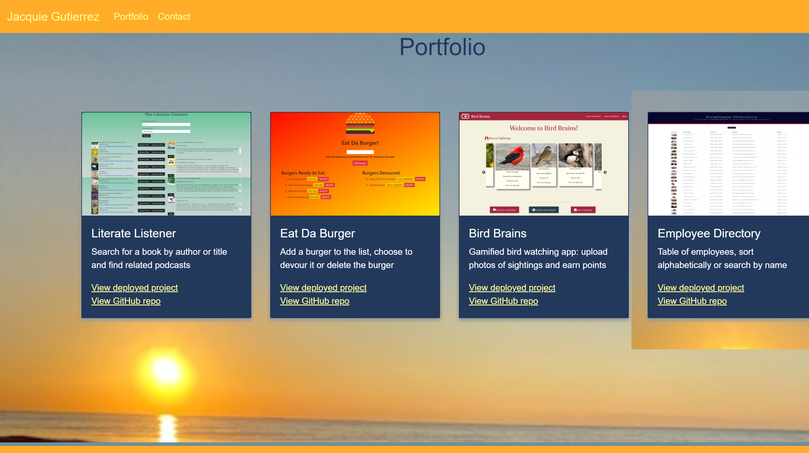
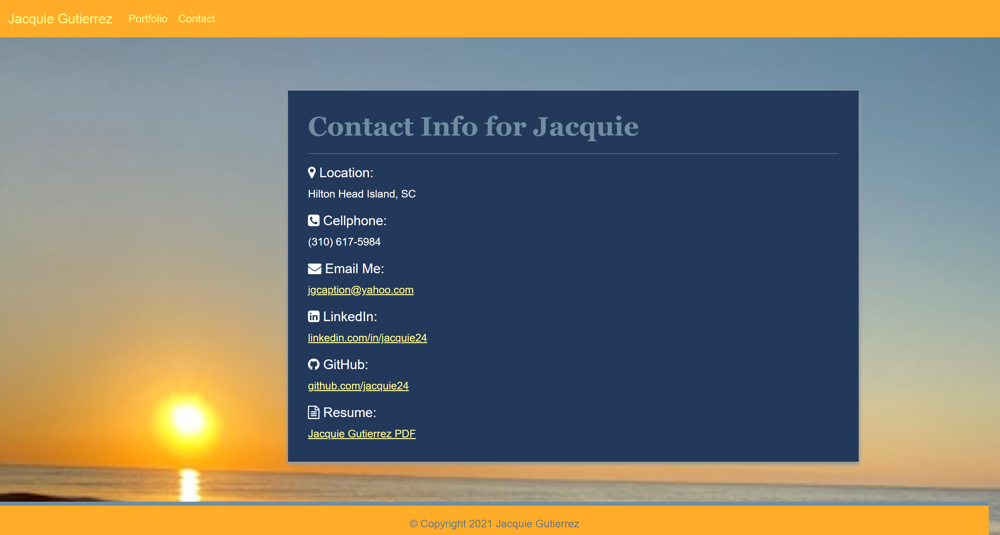

# JG Portfolio

## Description
The goal of this project was to create three linking web pages utilizing the Router feature of React.  The pages were built using React's reusable components for the project cards, navbar, and footer.  

The finished pages feature a navigation bar at the top containing three navigation links.  Each page features different content, but they bear similar color schemes and layouts, which gives the viewer a feeling of continuity.

To see the final result, you can view the webpages live at [jg-portfolio](https://jacquie24.github.io/jg-portfolio/).

## Table of Contents
- [Description](#Description)
- [Usage](#Usage)
- [License](#License)
- [Installation](#Installation)
- [References](#References)

## Usage
When the user clicks on the link, the page defaults to the About Me screen as the home page.  At the top are three navigation links, titled "About," "Portfolio," and "Contact."  
"Portfolio" will take the user to the Portfolio screen to view my projects. 
"Contact" will take the user to the Contact screen, where there is a fillable form to provide contact information. 
"About" brings the user back to the About Me screen.  
In addition, by clicking on my name "Jacquie Gutierrez" in the upper left hand corner, it will bring the user to the About Me (default home page).

## Installation
To view this webpage and any others I've designed, check out my GitHub page at [Jacquie24](https://github.com/Jacquie24?tab=repositories).  

## References
* [React Router documentation on HashRouter](https://reactrouter.com/web/api/HashRouter)
* [Peter Colella's React Images Repo](https://github.com/petercolella/react-images)

## License
This page is using the [MIT](assets/license.txt) license.